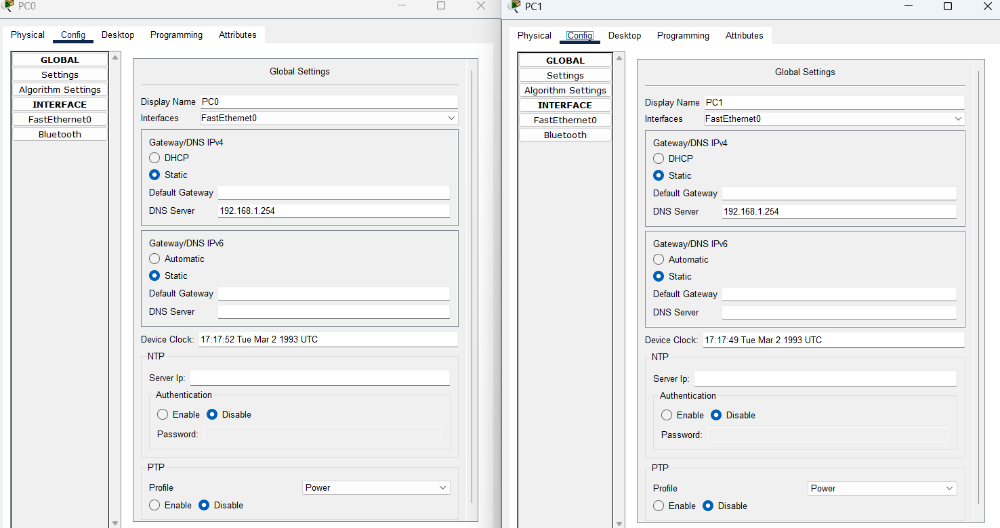
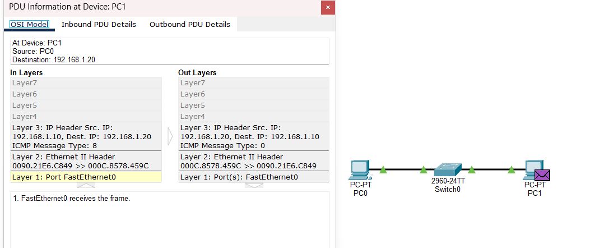
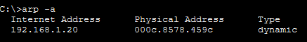

# Lab 01 — LAN Communication & ARP Analysis

## Objective

The objective of this lab is to analyze basic communication between two hosts within the same local network using Cisco Packet Tracer.

The lab focuses on understanding the relationship between IPv4 addresses, MAC addresses, ARP resolution, and ICMP Echo Request/Reply messages.

It also provides a basic networking foundation for understanding network traffic from a SOC L1 perspective.

## Network Topology

The lab consists of two PCs connected through a Cisco Catalyst 2960 switch.

```text
PC0 (192.168.1.10)
        |
        |
   Cisco 2960
        |
        |
PC1 (192.168.1.20)
```

---

## IP Configuration

Both hosts were configured with static IPv4 addresses within the same /24 network.

| Device | IPv4 Address |  Subnet Mask  |
|--------|--------------|---------------|
|  PC0   | 192.168.1.10 | 255.255.255.0 |
|  PC1   | 192.168.1.20 | 255.255.255.0 |

A default gateway was configured in the Packet Tracer hosts, but it was not required for communication between PC0 and PC1 because both hosts belong to the same local subnet.



---

## Methodology

The following procedure was used to test communication between PC0 and PC1:

1. Verified the initial ARP table on PC0 using `arp -a`.
2. Generated ICMP traffic from PC0 to PC1 using `ping 192.168.1.20`.
3. Switched to Simulation Mode in Cisco Packet Tracer to observe the network events.
4. Examined the ARP and ICMP events and their progression through the network.
5. Verified the ARP table on PC0 again after communication was established.

## ARP Analysis

---

Before generating traffic, PC0 was checked for existing ARP entries using:

```cmd
C:\>arp -a
```

The initial ARP table did not contain an entry for PC1:

No ARP Entries Found.

After the `ping` command was executed, Cisco Packet Tracer was switched to Simulation Mode to inspect the traffic generated by the communication.

The simulation showed ARP activity before the ICMP communication was completed. PC0 needed to resolve the MAC address associated with PC1's IPv4 address.

The ARP process can be summarized as:

```text
PC0
192.168.1.10
      |
      | ARP Request
      | "Who has 192.168.1.20?"
      |
      v
Switch
      |
      v
PC1
192.168.1.20
      |
      | ARP Reply
      | "192.168.1.20 is at 000c.8578.459c"
      |
      v
PC0
```

---

## ICMP Analysis

After the ARP resolution process, PC0 was able to communicate with PC1 using ICMP.

The communication was tested with the following command:

```cmd
C:\>ping 192.168.1.20
```

In Simulation Mode, the ICMP exchange was observed between the two hosts.

PC0 sent an ICMP Echo Request to PC1 (Type 8), and PC1 responded with an ICMP Echo Reply (Type 0).

The observed flow was:

PC0 (192.168.1.10)
        |
        | ICMP Echo Request
        | Type 8
        v
PC1 (192.168.1.20)
        |
        | ICMP Echo Reply
        | Type 0
        v
PC0 (192.168.1.10)

The PDU details in Simulation Mode were inspected to verify the ICMP message types exchanged between the hosts.

The capture shows the ICMP PDU details observed during the communication between PC0 and PC1.



---

## ARP Final

After the ICMP communication was completed, the ARP table on PC0 was checked again using:

```cmd
C:\>arp -a
```

The ARP table now contained a dynamic entry for PC1:

| Internet Address | Physical Address | Type    |
| ---------------- | ---------------- | ------- |
| 192.168.1.20     | 000c.8578.459c   | dynamic |

This entry shows that PC0 successfully resolved the IPv4 address of PC1 to its corresponding MAC address through ARP.

The final ARP state confirms that the MAC address resolution performed before the ICMP communication was successful.



*The capture shows the ARP table on PC0 after network traffic was generated and the MAC address of PC1 was resolved.*

---

## Observations

The following observations were made during the network communication test:

* PC0 and PC1 were able to communicate directly because both hosts belong to the same IPv4 subnet.
* PC0 initially had no ARP entry for PC1.
* Before the ICMP communication could take place, PC0 performed ARP resolution to obtain PC1's MAC address.
* After the ARP exchange, the MAC address `000c.8578.459c` was stored as a dynamic ARP entry for `192.168.1.20`.
* ICMP Echo Request and Echo Reply packets were successfully exchanged between the two hosts.
* The Packet Tracer Simulation Mode showed the progression of the packets through the switch and provided information about the protocols and network layers involved.
* STP traffic generated by the switch was also visible during the simulation. This traffic was unrelated to the ICMP communication and was not part of the host-to-host communication analyzed in this lab.

These observations demonstrate how ARP resolution enables IPv4 communication over an Ethernet LAN and how ICMP can be used to verify connectivity between hosts.

---

## SOC L1 Perspective

Although this lab focuses on basic LAN communication, the concepts observed are relevant to SOC L1 monitoring and investigation.

From an analyst perspective, understanding the relationship between **IP addresses, MAC addresses, ARP, and ICMP** helps establish a baseline for normal network communication.

The traffic observed in this lab demonstrates several elements that can be relevant during an investigation:

* **ARP activity:** An analyst may investigate unusual ARP behavior, such as unexpected ARP requests, replies, or changes in IP-to-MAC associations.
* **ICMP traffic:** ICMP can be legitimate diagnostic traffic, but unusual ICMP activity may also require investigation depending on the source, destination, frequency, and context.
* **Source and destination analysis:** Identifying which host initiated communication and which host responded is an important part of understanding a network event.
* **Protocol and layer analysis:** Examining packet details and network layers can help an analyst understand how communication occurred and identify abnormal behavior.

This lab provides a basic foundation for analyzing network events before moving to more advanced monitoring tools such as Wireshark, IDS/IPS, SIEM, and EDR platforms.

---

## Evidence

The following screenshots were collected during the lab to document the network configuration, ARP resolution, and ICMP communication:

| Evidence | Description |
|----------|-------------|
| `01_topology.png` | Network topology showing PC0, the Cisco Catalyst 2960 switch, and PC1. |
| `02_ip_config.png` | IPv4 configuration of the hosts. |
| `03_arp_initial.png` | Initial ARP table before communication was generated. |
| `04_arp_table_populated.png` | ARP table after communication, showing the resolved IP-to-MAC association for PC1. |
| `05_icmp_pdu_details.png` | ICMP PDU details and packet progression observed in Simulation Mode, including the relevant layer information. |

The evidence supports the observations and analysis described throughout the lab and allows the communication process to be reproduced and reviewed.

---

## Conclusion

This lab demonstrated the basic process of communication between two hosts within the same local network.

The analysis showed how **ARP resolves an IPv4 address to a MAC address** before communication can take place, allowing PC0 to identify PC1 at the Ethernet layer. After the resolution process, **ICMP Echo Request and Echo Reply messages** were successfully exchanged between the hosts.

The Packet Tracer simulation also provided a practical view of packet progression and the information associated with different network layers.

From a SOC L1 perspective, this exercise provides a foundation for understanding normal network behavior and for recognizing when ARP or ICMP activity may require further investigation.

---
