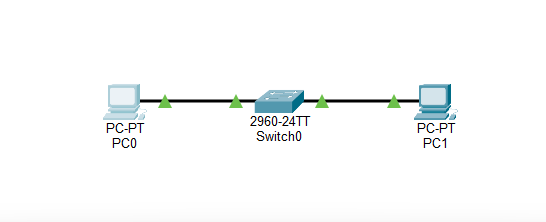
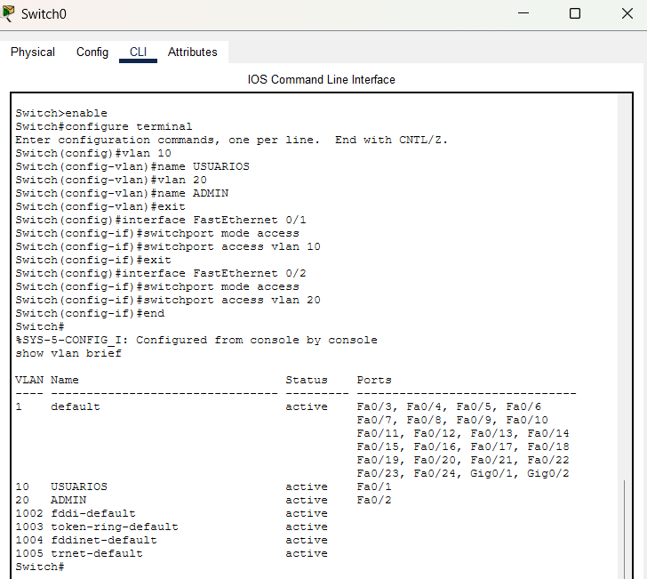
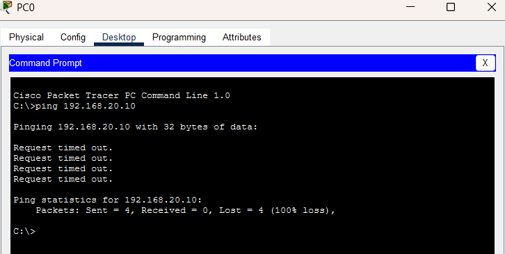
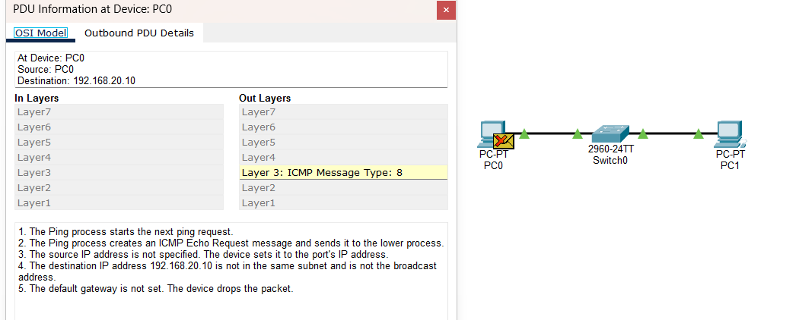

# Lab 02 — VLANs & Network Segmentation

## Objective

The objective of this lab is to configure and validate Virtual Local Area Networks (VLANs) on a Cisco Catalyst 2960 switch to achieve network segmentation at Layer 2.

This lab demonstrates how separating hosts into different VLANs creates distinct broadcast domains and logical network segments. It also introduces the role of a Layer 3 device in enabling communication between different subnets.

---

## Network Topology

The topology consists of two host PCs connected to a single Cisco Catalyst 2960 switch.

Each host belongs to a different VLAN and IPv4 subnet:

```text
PC0
192.168.10.10
VLAN 10 — USUARIOS
     |
   Fa0/1
     |
Cisco Catalyst 2960
     |
   Fa0/2
     |
PC1
192.168.20.10
VLAN 20 — ADMIN
```



---

## IP & VLAN Addressing

| Device | Interface | IPv4 Address | Subnet Mask | VLAN ID | VLAN Name |
|---|---|---|---|---|---|
| PC0 | FastEthernet0 | 192.168.10.10 | 255.255.255.0 | 10 | USUARIOS |
| PC1 | FastEthernet0 | 192.168.20.10 | 255.255.255.0 | 20 | ADMIN |

No default gateway was configured because inter-VLAN routing is outside the scope of this lab and will be addressed in a later lab.

---

## Switch Configuration

The following Cisco IOS commands were used to create the VLANs and assign the switch access ports:

```text
enable
configure terminal

! Create VLANs
vlan 10
 name USUARIOS
vlan 20
 name ADMIN
exit

! Assign PC0 to VLAN 10
interface FastEthernet 0/1
 switchport mode access
 switchport access vlan 10
exit

! Assign PC1 to VLAN 20
interface FastEthernet 0/2
 switchport mode access
 switchport access vlan 20
exit

end
```

The configuration was verified using:

```text
show vlan brief
```

The switch associates traffic received through `Fa0/1` with VLAN 10 and traffic received through `Fa0/2` with VLAN 20.



---

## Connectivity Testing & Analysis

### 1. ICMP Ping Test

An ICMP Echo Request was initiated from PC0 (`192.168.10.10`) toward PC1 (`192.168.20.10`):

```text
C:\>ping 192.168.20.10

Pinging 192.168.20.10 with 32 bytes of data:

Request timed out.
Request timed out.
Request timed out.
Request timed out.

Ping statistics for 192.168.20.10:
    Packets: Sent = 4, Received = 0, Lost = 4 (100% loss),
```



The ping failed because the destination belongs to a different IPv4 subnet and no default gateway was configured on PC0.

---

### 2. Simulation Mode — Host Routing Decision

Packet Tracer Simulation Mode was used to inspect the ICMP PDU at PC0.

The simulation showed:

- PC0 created an ICMP Echo Request for `192.168.20.10`.
- PC0 determined that the destination was not in its local subnet.
- The destination therefore required forwarding through a default gateway.
- No default gateway was configured.
- PC0 dropped the packet before transmitting it toward the switch.



This demonstrates an important distinction: the failed ping in this test was stopped at the source host because no Layer 3 route was available. The test therefore does not indicate that the switch received and blocked the ICMP packet.

---

## VLAN Segmentation Analysis

The switch configuration places the two access ports into separate VLANs:

```text
Fa0/1 → VLAN 10 → 192.168.10.0/24
Fa0/2 → VLAN 20 → 192.168.20.0/24
```

VLAN 10 and VLAN 20 represent separate Layer 2 broadcast domains.

Hosts in different VLANs cannot communicate directly at Layer 2. Communication between the two IP subnets requires a Layer 3 device, such as a router or Layer 3 switch.

This will be demonstrated in the next lab through Inter-VLAN Routing.

---

## STP Observation

During Simulation Mode, Spanning Tree Protocol (STP) traffic was also observed.

STP is used by switches to exchange information about network topology and prevent Layer 2 switching loops when redundant paths exist.

The STP traffic observed during the simulation was separate from the ICMP connectivity test. The end hosts did not participate in STP processing.

---

## Key Takeaways

- VLANs can divide a physical switch into separate logical network segments.
- Access ports can be assigned to specific VLANs.
- VLAN 10 and VLAN 20 create separate Layer 2 broadcast domains.
- Hosts in different IP subnets require a Layer 3 device to communicate.
- A default gateway is required when a host needs to reach a destination outside its local subnet.
- Packet Tracer Simulation Mode can be used to inspect where and why a packet is dropped.

---

## SOC L1 Perspective

Network segmentation is an important security control because it can restrict communication between different parts of an environment.

From a SOC L1 perspective, understanding VLANs and routing helps analysts interpret network events involving:

- Source and destination IP addresses
- Different network segments
- Internal communication between hosts
- Routing paths
- Unexpected communication between segmented environments

If communication between network segments is observed in a real environment, an analyst can investigate whether the traffic is expected, authorized, and consistent with the organization's network architecture.

VLAN segmentation can also reduce the potential for unrestricted lateral movement after an endpoint is compromised, although VLANs alone do not provide complete security isolation.

---

## Evidence

| Evidence | Description |
|---|---|
| `01-vlan-topology.png` | Packet Tracer topology showing PC0, the Cisco Catalyst 2960 switch, and PC1. |
| `02-vlan-config.png` | Switch CLI showing VLAN 10 and VLAN 20 with their assigned access ports. |
| `03-ping-failed.png` | PC0 ping attempt toward PC1 showing 100% packet loss. |
| `04-host-routing-failure.png` | Packet Tracer Simulation Mode showing PC0 dropping the ICMP packet because no default gateway was configured. |

---

## Conclusion

This lab demonstrated how VLANs can be used to segment hosts into separate Layer 2 broadcast domains.

PC0 and PC1 were placed in different VLANs and IPv4 subnets. The connectivity test failed because PC0 identified the destination as being outside its local subnet and no default gateway or Layer 3 routing device was available.

The lab provides a foundation for understanding network segmentation, routing, and traffic analysis from a networking and SOC L1 perspective.

The next lab will build on this configuration by introducing Inter-VLAN Routing to enable controlled communication between the two VLANs.