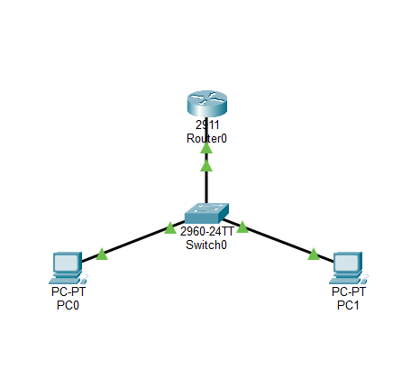
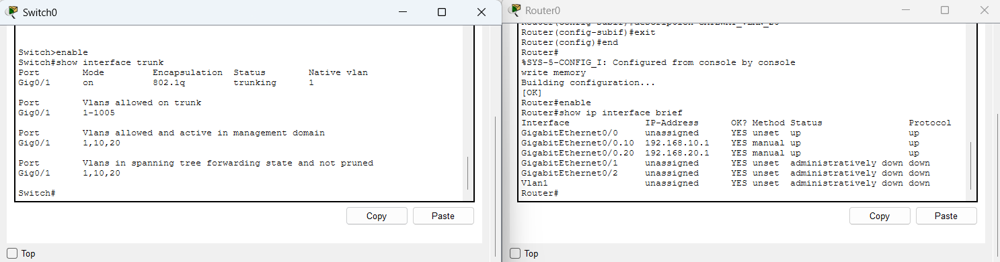
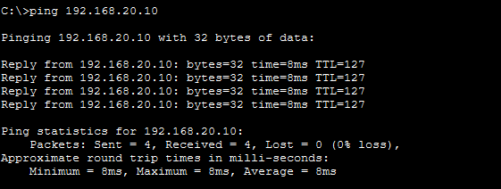
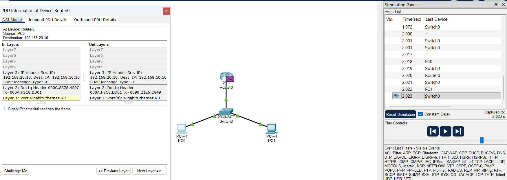

# Lab 03 - Inter-VLAN Routing (Router-on-a-Stick)

## Objective

This lab configures and validates Inter-VLAN Routing using a Router-on-a-Stick architecture with a Cisco Catalyst 2960 switch and a Cisco 2911 router.

The lab builds on the Layer 2 segmentation from Lab 02 by introducing an 802.1Q trunk and a Layer 3 routing device. The goal is to enable communication between hosts in different VLANs and IPv4 subnets.

---

## Network Topology

The topology consists of two PCs connected to a Cisco Catalyst 2960 switch. The switch connects to a Cisco 2911 router through a trunk link on `GigabitEthernet0/1`.

- PC0 belongs to VLAN 10 (`USUARIOS`).
- PC1 belongs to VLAN 20 (`ADMIN`).
- Router0 provides the default gateway for both VLANs through subinterfaces.




---

## IP and VLAN Addressing

| Device | Interface | IPv4 Address | Subnet Mask | Default Gateway | VLAN | Description |
|---|---|---|---|---|---|---|
| PC0 | FastEthernet0 | 192.168.10.10 | 255.255.255.0 | 192.168.10.1 | 10 - USUARIOS | User host |
| PC1 | FastEthernet0 | 192.168.20.10 | 255.255.255.0 | 192.168.20.1 | 20 - ADMIN | Administration host |
| Switch0 | GigabitEthernet0/1 | N/A | N/A | N/A | Trunk | Link to Router0 |
| Router0 | GigabitEthernet0/0.10 | 192.168.10.1 | 255.255.255.0 | N/A | 10 - USUARIOS | VLAN 10 gateway |
| Router0 | GigabitEthernet0/0.20 | 192.168.20.1 | 255.255.255.0 | N/A | 20 - ADMIN | VLAN 20 gateway |

---

## Configuration

### 1. Switch Configuration - 802.1Q Trunk

The switch port connected to the router was configured as a trunk so traffic from VLAN 10 and VLAN 20 could use the same physical link.

```text
enable
configure terminal

interface GigabitEthernet 0/1
 description ENLACE_TRUNK_AL_ROUTER
 switchport mode trunk
exit

end
write memory
```

The trunk was verified with:

```text
show interfaces trunk
```

This verification confirmed that `Gi0/1` was operating as an 802.1Q trunk and carrying the required VLANs.

### 2. Router Configuration - Router-on-a-Stick

The router's physical interface was enabled, and two subinterfaces were configured. Each subinterface acts as the default gateway for its corresponding VLAN.

```text
enable
configure terminal

interface GigabitEthernet 0/0
 no shutdown
exit

interface GigabitEthernet 0/0.10
 encapsulation dot1Q 10
 ip address 192.168.10.1 255.255.255.0
 description GATEWAY_VLAN_10_USUARIOS
exit

interface GigabitEthernet 0/0.20
 encapsulation dot1Q 20
 ip address 192.168.20.1 255.255.255.0
 description GATEWAY_VLAN_20_ADMIN
exit

end
write memory
```

The router interfaces were verified with:

```text
show ip interface brief
```

Expected relevant output:

```text
GigabitEthernet0/0.10    192.168.10.1    up    up
GigabitEthernet0/0.20    192.168.20.1    up    up
```

This confirmed that the Layer 3 gateways for both VLANs were active.



---

## Connectivity Testing

### ICMP Ping Test

After configuring the trunk and Router-on-a-Stick setup, an ICMP Echo Request was sent from PC0 (`192.168.10.10`) to PC1 (`192.168.20.10`).

```text
C:\>ping 192.168.20.10

Pinging 192.168.20.10 with 32 bytes of data:

Reply from 192.168.20.10: bytes=32 time=8ms TTL=127
Reply from 192.168.20.10: bytes=32 time=8ms TTL=127
Reply from 192.168.20.10: bytes=32 time=8ms TTL=127
Reply from 192.168.20.10: bytes=32 time=8ms TTL=127

Ping statistics for 192.168.20.10:
    Packets: Sent = 4, Received = 4, Lost = 0 (0% loss),
```



The successful test confirmed that PC0 in VLAN 10 could communicate with PC1 in VLAN 20 through the Layer 3 routing path.

---

## Simulation Mode - Packet Flow Analysis

Packet Tracer Simulation Mode was used to observe the ICMP traffic between the two hosts.

The Echo Request followed this path:

```text
PC0 -> Switch0 -> Router0 -> Switch0 -> PC1
```

Because PC1 is outside PC0's local subnet, PC0 sends the traffic to its default gateway, `192.168.10.1`. The switch carries VLAN 10 through the trunk to Router0. Router0 receives the packet on `Gi0/0.10`, performs the Layer 3 routing decision, and forwards it toward VLAN 20 through `Gi0/0.20`. The switch then delivers the traffic to PC1 through the VLAN 20 access port.

The ICMP Echo Reply followed the reverse path:

```text
PC1 -> Switch0 -> Router0 -> Switch0 -> PC0
```



This confirmed that communication worked in both directions.

---

## VLAN and Routing Analysis

Lab 02 demonstrated that VLAN 10 and VLAN 20 were isolated Layer 2 broadcast domains. In this lab, Router0 provides the Layer 3 connectivity required between their different IPv4 subnets.

```text
VLAN 10: 192.168.10.0/24
Gateway: 192.168.10.1 (Router0 Gi0/0.10)
          |
          | Layer 3 routing
          v
Gateway: 192.168.20.1 (Router0 Gi0/0.20)
VLAN 20: 192.168.20.0/24
```

The trunk transports both VLANs between the switch and router over one physical connection, while the router's subinterfaces provide a separate gateway for each subnet.

## Key Observations

- VLAN 10 and VLAN 20 remained separate Layer 2 broadcast domains.
- The switch trunk carried traffic for both VLANs between Switch0 and Router0.
- Router0 provided one default gateway per VLAN through separate subinterfaces.
- `Gi0/0.10` was associated with VLAN 10 (`USUARIOS`) and `192.168.10.1`.
- `Gi0/0.20` was associated with VLAN 20 (`ADMIN`) and `192.168.20.1`.
- The final ping result was 4 packets received with 0% packet loss.

---

## SOC L1 Perspective

Understanding Inter-VLAN Routing is important for a SOC analyst because internal traffic can cross subnet and VLAN boundaries through Layer 3 devices.

From a SOC L1 perspective, analyzing communication between network segments requires understanding:

- Source and destination IP addresses
- Source and destination network segments
- Default gateways
- Layer 2 VLAN membership
- Layer 3 routing paths
- Expected versus unexpected internal communication

In a real environment, this knowledge helps an analyst determine whether traffic between internal segments follows the expected network architecture and provides context when investigating suspicious internal communication or potential lateral movement.

---

## Evidence

| Evidence | Description |
|---|---|
| `01-intervlan-topology.png` | Packet Tracer topology showing PC0, Switch0, Router0, and PC1 with active links. |
| `02-trunk-router-config.png` | Switch trunk and Router0 subinterface configuration. |
| `03-successful-ping.png` | PC0 command prompt showing successful communication with PC1 and 0% packet loss. |
| `04-icmp-routing-simulation.png` | Packet Tracer Simulation Mode showing ICMP traffic crossing the switch, router, switch, and destination host. |

---

## Conclusion

This lab successfully demonstrated Inter-VLAN Routing using a Router-on-a-Stick architecture.

Building on the VLAN segmentation from Lab 02, an 802.1Q trunk and Router0 subinterfaces were configured to provide Layer 3 connectivity between VLAN 10 (`USUARIOS`) and VLAN 20 (`ADMIN`).

The successful ICMP test and Simulation Mode analysis confirmed that traffic could travel from PC0 to PC1 through the router and that the Echo Reply could return through the reverse path.

This lab establishes a practical foundation for understanding VLAN segmentation, trunking, default gateways, Layer 3 routing, and internal network traffic analysis from a SOC L1 perspective.