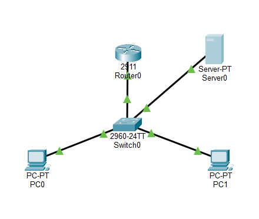
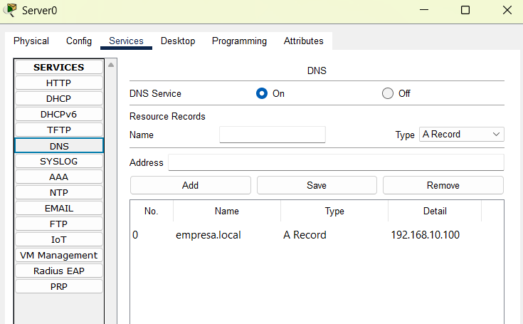
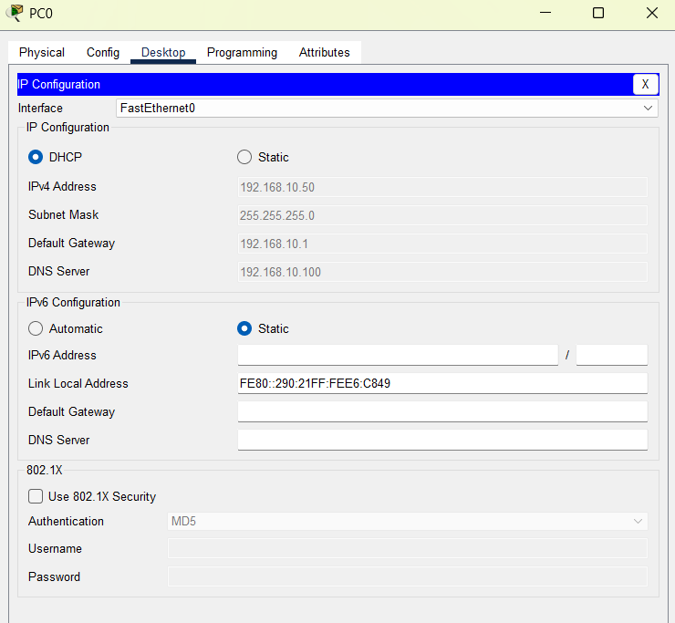
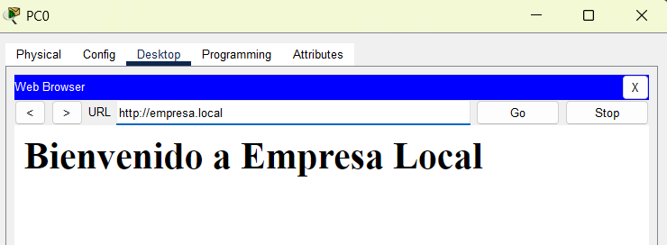

# Lab 04 - DHCP, DNS, and Local Web Services

## Objective

This lab configures and validates basic network services in Cisco Packet Tracer, focusing on DHCP, DNS, and HTTP.

The lab demonstrates how a client can obtain its network configuration through DHCP, resolve a local hostname through DNS, and access a web service using both an IP address and an FQDN.

---

## Network Topology

The topology consists of two PCs, one server, one Cisco Catalyst 2960 switch, and one Cisco 2911 router. All end devices operate in VLAN 10 and the `192.168.10.0/24` network.

- `PC0` acts as a DHCP client.
- `PC1` is also connected to VLAN 10.
- `Server0` provides DHCP, DNS, and HTTP services.
- `Router0` provides the default gateway for VLAN 10.
- `Switch0` provides Layer 2 connectivity between the devices.



---

## IP Addressing

| Device | Interface | IPv4 Address | Subnet Mask | Default Gateway | Role |
|---|---|---|---|---|---|
| Router0 | GigabitEthernet0/0.10 | 192.168.10.1 | 255.255.255.0 | N/A | VLAN 10 gateway |
| Server0 | FastEthernet0 | 192.168.10.100 | 255.255.255.0 | 192.168.10.1 | DHCP, DNS, and HTTP server |
| PC0 | FastEthernet0 | DHCP | 255.255.255.0 | DHCP | DHCP client |
| PC1 | FastEthernet0 | DHCP | 255.255.255.0 | DHCP | VLAN 10 host |

---

## Service Configuration

### 1. Server0 Static Configuration

Server0 was configured with a static IPv4 address so clients could consistently reach the DHCP, DNS, and HTTP services.

| Parameter | Value |
|---|---|
| IPv4 address | `192.168.10.100` |
| Subnet mask | `255.255.255.0` |
| Default gateway | `192.168.10.1` |

The following services were enabled on Server0:

- DHCP
- DNS
- HTTP

### 2. DHCP Configuration

The DHCP service was enabled on Server0 with the following pool:

| Parameter | Value |
|---|---|
| DHCP service | On |
| Pool name | `serverPool` |
| Starting IP address | `192.168.10.50` |
| Subnet mask | `255.255.255.0` |
| Default gateway | `192.168.10.1` |
| DNS server | `192.168.10.100` |

PC0 was configured to obtain its network configuration dynamically through DHCP.

### 3. DNS Configuration

The DNS service was enabled on Server0. An A record was created to associate the local hostname with the web server's IP address:

| Hostname | Record type | Address |
|---|---|---|
| `empresa.local` | A Record | `192.168.10.100` |

This allows a client using `192.168.10.100` as its DNS server to resolve `empresa.local` to the web server's IP address.



### 4. HTTP Configuration

The HTTP service was enabled on Server0 and a local web page was configured with the following content:

```text
Bienvenido a Empresa Local
```

---

## Troubleshooting and Verification

### 1. Initial DHCP Failure

During the initial deployment, PC0 did not obtain the expected DHCP configuration. The client displayed:

```text
DHCP failed. APIPA is being used.
```

PC0 received the automatic link-local address:

```text
169.254.200.73
```

This indicated that the DHCP request did not receive a valid response from Server0.

### 2. Link Troubleshooting

The server-side interface and physical connection were checked. The connection was reset and re-established. After the link became active, PC0 was able to obtain its expected configuration through DHCP.

The exact underlying cause of the initial link problem was not conclusively determined during the simulation. Therefore, this lab does not attribute the DHCP failure to a specific STP state or other protocol behavior.

### 3. DHCP Verification

After the connectivity issue was resolved, PC0 successfully obtained the following configuration through DHCP:

| Parameter | Value |
|---|---|
| IPv4 address | `192.168.10.50` |
| Subnet mask | `255.255.255.0` |
| Default gateway | `192.168.10.1` |
| DNS server | `192.168.10.100` |



The gateway and DNS server values were also received automatically through the DHCP configuration.

### 4. DNS Verification

Before the DNS A record was configured, PC0 was unable to resolve `empresa.local` and the browser displayed:

```text
Host Name Unresolved
```

After the A record was added, the hostname resolved successfully to `192.168.10.100`.

### 5. Web Service Verification

Two HTTP access tests were performed from PC0:

1. Direct access by IP address: `http://192.168.10.100`
2. Access by FQDN: `http://empresa.local`

Both addresses loaded the local web page. The FQDN test is shown below:



The page displayed:

```text
Bienvenido a Empresa Local
```

---

## End-to-End Service Flow

The final configuration demonstrated the interaction between DHCP, DNS, and HTTP:

1. PC0 requests network configuration through DHCP.
2. Server0 provides the IPv4 address, default gateway, and DNS server.
3. PC0 uses `192.168.10.100` to resolve `empresa.local`.
4. DNS returns `192.168.10.100` for the hostname.
5. PC0 connects to the HTTP service hosted on Server0.
6. The local web page is displayed successfully.

---

## Key Observations

- Server0 used the static address `192.168.10.100`.
- Server0 provided DHCP, DNS, and HTTP services.
- PC0 initially failed to obtain its DHCP configuration and received the APIPA address `169.254.200.73`.
- The server-side connection was checked and re-established during troubleshooting.
- PC0 subsequently obtained `192.168.10.50` through DHCP.
- DHCP provided the default gateway `192.168.10.1` and DNS server `192.168.10.100`.
- The DNS record `empresa.local` pointed to `192.168.10.100`.
- Direct HTTP access by IP and access through `http://empresa.local` were successful.

---

## SOC L1 Perspective

Understanding common network services is important for a SOC analyst because DHCP, DNS, and HTTP activity can provide useful context during security investigations.

From a SOC L1 perspective:

- DHCP provides context about IP address assignments to network clients.
- DNS shows which hostnames clients attempt to resolve.
- HTTP provides context about web communication.
- An expected network baseline helps analysts distinguish normal service activity from unexpected behavior.

For example, knowing that `empresa.local` legitimately resolves to `192.168.10.100` provides baseline context when analyzing DNS or HTTP-related activity.

---

## Evidence

| Evidence | Description |
|---|---|
| `01-topology-overview.png` | Packet Tracer topology showing Router0, Switch0, Server0, PC0, and PC1 with active links. |
| `02-dhcp-success-pc0.png` | PC0 configuration showing the IPv4 address obtained through DHCP, including the gateway and DNS server. |
| `03-dns-a-record-server.png` | Server0 DNS service showing the A record mapping `empresa.local` to `192.168.10.100`. |
| `04-web-access-domain.png` | PC0 browser successfully accessing the local web service through `http://empresa.local`. |

---

## Conclusion

This lab successfully demonstrated the interaction between DHCP, DNS, and HTTP services in a local network environment.

PC0 initially failed to obtain its expected DHCP configuration and received an APIPA address. After troubleshooting and restoring the network connection, PC0 successfully received its configuration dynamically from Server0.

The DNS service was then configured with an A record mapping `empresa.local` to `192.168.10.100`. Direct access to the HTTP service by IP was successful, and after configuring the DNS record, the same service could be accessed using the FQDN `http://empresa.local`.

This lab provides a practical foundation for understanding how common network services operate together and how their activity can provide useful context during network and security monitoring.
